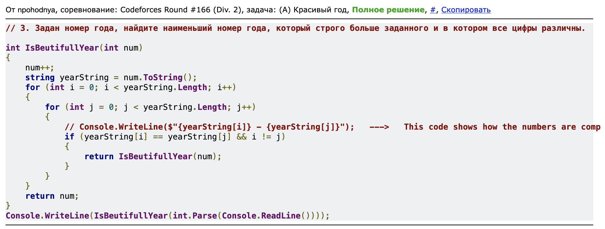

### Для удобства можно переходить сразу к заданию по ссылкам!
#
### Курс: Знакомство с языками программирования (семинары). 
#
# Практическое задание №1
0. По двум заданным числам проверять является ли первое квадратом второго. **Cсылка:** [тык](https://github.com/npokhodnya/Homework_CSharp/tree/master/Seminar_1/01_IsFirstSquareSecond)

1. По заданному номеру дня недели вывести его название. **Cсылка:** [тык](https://github.com/npokhodnya/Homework_CSharp/tree/master/Seminar_1/02_DaysOfTheWeek)

2. Найти максимальное из трех чисел. **Cсылка:** [тык](https://github.com/npokhodnya/Homework_CSharp/tree/master/Seminar_1/03_MaxInThree)

3. Выяснить является ли число чётным. **Cсылка:** [тык](https://github.com/npokhodnya/Homework_CSharp/tree/master/Seminar_1/04_IsEvenNumber)

4. Показать числа от -N до N. **Cсылка:** [тык](https://github.com/npokhodnya/Homework_CSharp/tree/master/Seminar_1/05_FromMinusNToN)

5. Показать последнюю цифру трёхзначного числа. **Cсылка:** [тык](https://github.com/npokhodnya/HomeWork_1/blob/master/06_LastDigitOfThree-DigitNumber/Program.cs)

6. Показать вторую цифру трёхзначного числа. **Cсылка:** [тык](https://github.com/npokhodnya/Homework_CSharp/tree/master/Seminar_1/06_LastDigitOfThree-DigitNumber)

7. Дано число из отрезка [10, 99]. Показать наибольшую цифру числа. **Cсылка:** [тык](https://github.com/npokhodnya/Homework_CSharp/tree/master/Seminar_1/07_SecondDigitOfThree-DigitNumber)

8. Удалить вторую цифру трёхзначного числа. **Cсылка:** [тык](https://github.com/npokhodnya/Homework_CSharp/tree/master/Seminar_1/09_DeleteSecondDigit)

9. Выяснить, кратно ли число заданному, если нет, вывести остаток. **Cсылка:** [тык](https://github.com/npokhodnya/Homework_CSharp/tree/master/Seminar_1/10_IsNumberMultipleOfGivenNumber)

10. Найти третью цифру числа или сообщить, что её нет. **Cсылка:** [тык](https://github.com/npokhodnya/Homework_CSharp/tree/master/Seminar_1/11_FindThirdDigit)

# Практическое задание №2
0. Дано число обозначающее день недели. Выяснить является номер дня недели выходным. **Cсылка:** [тык](https://github.com/npokhodnya/Homework_CSharp/tree/master/Seminar_2/01_IsNumOfTheWeek-Weekend)

1. По двум заданным числам проверять является ли одно квадратом другого. **Cсылка:** [тык](https://github.com/npokhodnya/Homework_CSharp/tree/master/Seminar_2/02_IsNumAQuoterOfAnotherNum)

2. Задать номер четверти, показать диапазоны для возможных координат. **Cсылка:** [тык](https://github.com/npokhodnya/Homework_CSharp/tree/master/Seminar_2/03_ShowRangesForPossibleCoordinates)

3. Найти расстояние между точками в пространстве 2D/3D. **Cсылка:** [тык](https://github.com/npokhodnya/Homework_CSharp/tree/master/Seminar_2/04_Distance2Points_2_3_D)

4. Найти кубы чисел от 1 до N. **Cсылка:** [тык](https://github.com/npokhodnya/Homework_CSharp/tree/master/Seminar_2/05_PrintNumbersFrom_1_ToN_InThreeDegree)

5. Найти сумму чисел от 1 до А. **Cсылка:** [тык](https://github.com/npokhodnya/Homework_CSharp/tree/master/Seminar_2/06_PrintSumOfNumbers)

6. Определить количество цифр в числе. **Cсылка:** [тык](https://github.com/npokhodnya/Homework_CSharp/tree/master/Seminar_2/07_CountOfDigits)

7. Подсчитать сумму цифр в числе. **Cсылка:** [тык](https://github.com/npokhodnya/Homework_CSharp/tree/master/Seminar_2/08_SumOfDigits)

8. Написать программу вычисления произведения чисел от 1 до N. **Cсылка:** [тык](https://github.com/npokhodnya/Homework_CSharp/tree/master/Seminar_2/09_MultipleOfNumbers_1_To_N)

9. Показать кубы чисел, заканчивающихся на четную цифру. **Cсылка:** [тык](https://github.com/npokhodnya/Homework_CSharp/tree/master/Seminar_2/10_CubesOfNums)

# Практическое задание №3
0. Задать массив из 8 элементов, заполненных нулями и единицами вывести их на экран. **Cсылка:** [тык](https://github.com/npokhodnya/Homework_CSharp/tree/master/Seminar_3/01_Massive_1And0)

1. Задать массив из 12 элементов, заполненных числами из [0,9]. Найти сумму положительных/отрицательных элементов массива. **Cсылка:** [тык](https://github.com/npokhodnya/Homework_CSharp/tree/master/Seminar_3/02_SumOfElements)

2. Написать программу замену элементов массива на противоположные. **Cсылка:** [тык](https://github.com/npokhodnya/Homework_CSharp/tree/master/Seminar_3/03_ChangeElementsOfMassive)

3. Определить, присутствует ли в заданном массиве, некоторое число. **Cсылка:** [тык](https://github.com/npokhodnya/Homework_CSharp/tree/master/Seminar_3/04_FindElement)

4. Задать массив, заполнить случайными положительными трёхзначными числами. Показать количество нечетных\четных чисел. **Cсылка:** [тык](https://github.com/npokhodnya/Homework_CSharp/tree/master/Seminar_3/05_SumOfEvenElementsAndDon'tEvenElements)

5. В одномерном массиве из 123 чисел найти количество элементов из отрезка [10,99]. **Cсылка:** [тык](https://github.com/npokhodnya/Homework_CSharp/tree/master/Seminar_3/06_SumOfElementsIn_10_99)

6. Найти сумму чисел одномерного массива стоящих на нечетной позиции. **Cсылка:** [тык](https://github.com/npokhodnya/Homework_CSharp/tree/master/Seminar_3/07_SumOfElementsOnEvenIndex)

7. Найти произведение пар чисел в одномерном массиве. Парой считаем первый и последний элемент, второй и предпоследний и т.д. **Cсылка:** [тык](https://github.com/npokhodnya/Homework_CSharp/tree/master/Seminar_3/08_MultiplicationOfPairsNumbers)

8. В Указанном массиве вещественных чисел найдите разницу между максимальным и минимальным элементом. **Cсылка:** [тык](https://github.com/npokhodnya/Homework_CSharp/tree/master/Seminar_3/09_CheckMaxAndMinElementDifference)

# Практическое задание №4
1. Найти точку пересечения двух прямых заданных уравнением `y = k1 * x + b1, y = k2 * x + b2`;  `b1`, `k1` и `b2` и `k2` заданы. **Cсылка:** [тык](https://github.com/npokhodnya/Homework_CSharp/tree/master/Seminar_4/01_Point)

2. Написать программу масштабирования фигуры. **Cсылка:** [тык](https://github.com/npokhodnya/Homework_CSharp/tree/master/Seminar_4/02_ScaleTriangle)

```
Тут для тех кто далеко улетел, чтобы задавались вершины фигуры списком (одной строкой) 
например: "(0,0) (2,0) (2,2) (0,2)" коэффициент
масштабирования k задавался отдельно - 2 или 4 или 0.5 В результате показать координаты, 
которые получатся. при k = 2 получаем "(0,0) (4,0) (4,4) (0,4)"
```

3.  Написать программу копирования массива. **Cсылка:** [тык](https://github.com/npokhodnya/Homework_CSharp/tree/master/Seminar_4/03_CopyMassive)

# Практическое задание №5
1. Театральная площадь в столице Берляндии представляет собой прямоугольник n × m метров... **Cсылка:** [тык](https://github.com/npokhodnya/Homework_CSharp/tree/master/Seminar_5/01_TeatralPlace)

Фото решения:


2. Слоник решил сходить в гости к другу... **Cсылка:** [тык](https://github.com/npokhodnya/Homework_CSharp/tree/master/Seminar_5/02_Elephant)

Фото решения:


3.  Задан номер года, найдите наименьший номер года, который строго больше заданного и в котором все цифры различны. **Cсылка:** [тык](https://github.com/npokhodnya/Homework_CSharp/tree/master/Seminar_5/03_BeautifulYear)

Фото решения:



4.  Петя называет число почти счастливым, если количество счастливых цифр в нем — счастливое число. Ему интересно, является ли число `n` почти счастливым. **Cсылка:** [тык](https://github.com/npokhodnya/Homework_CSharp/tree/master/Seminar_5/04_IsNumHappy)

Фото решения:


5. Сколько долларов ему придется одолжить у однополчанина, чтобы купить `w` бананов? **Cсылка:** [тык](https://github.com/npokhodnya/Homework_CSharp/tree/master/Seminar_5/05_HowMuchWillASoldierHaveToBorrow)

Фото решения:


# Практическое задание №6
1. Показать двумерный массив размером `m × n` заполненный вещественными числами. **Cсылка:** [тык](https://github.com/npokhodnya/Homework_CSharp/tree/master/Seminar_6/01_PrintMatrix)

2. Задать двумерный массив следующим правилом: `Aₘₙ = m+n`. **Cсылка:** [тык](https://github.com/npokhodnya/Homework_CSharp/tree/master/Seminar_6/02_NewMatrixMN)

3. В двумерном массиве заменить элементы, у которых оба индекса чётные на их квадраты. **Cсылка:** [тык](https://github.com/npokhodnya/Homework_CSharp/tree/master/Seminar_6/03_ChangeMatrix)